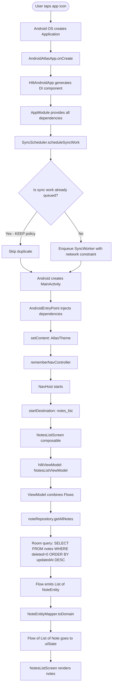
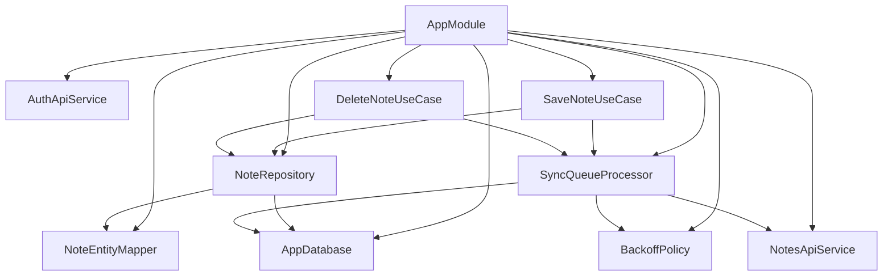

# 01 — App Startup Flow

> **Note:** Flowcharts use [Mermaid](https://mermaid.js.org/) syntax. View rendered diagrams in: **VS Code** (install "Markdown Preview Mermaid Support"), **GitHub** (renders automatically), or **Obsidian/Notion** (native support).

## What Happens When the App Launches

When the user taps the app icon, Android creates the `Application` class first, then the `Activity`. Hilt wires up all dependencies before any screen is shown.

---

## Flowchart



---

## Classes Involved

| Class | Module | Role |
|-------|--------|------|
| `AndroidAtlasApp` | `:app` | Hilt entry point, starts sync scheduler |
| `AppModule` | `:app` | Provides all DI dependencies |
| `SyncScheduler` | `:core:sync` | Enqueues WorkManager sync job |
| `SyncWorker` | `:core:sync` | Background sync worker |
| `MainActivity` | `:app` | Hosts NavHost, Compose entry |
| `NotesListViewModel` | `:feature:notes-list` | Combines notes + search + sync flows |
| `NoteRepository` | `:core:database` | Reads notes from Room |
| `NoteDao` | `:core:database` | Room SQL queries |
| `NoteEntityMapper` | `:core:database` | Entity → domain model |
| `AppDatabase` | `:core:database` | Room database singleton |

---

## Hilt Dependency Graph (on startup)



---

## Data State at Each Stage

### Stage 1: Room Query
```sql
SELECT * FROM notes WHERE deleted = 0 ORDER BY updatedAt DESC
```

### Stage 2: Raw `NoteEntity` from Room
```
NoteEntity(
  id = "abc-123",
  title = "My Note",
  content = "Some content",
  folderOrLabel = "Work",
  updatedAt = "2024-01-15T10:30:00Z",
  deleted = false,
  syncStatus = SyncStatus.SYNCED   ← stripped before UI sees it
)
```

### Stage 3: After `NoteEntityMapper.toDomain()`
```
Note(
  id = "abc-123",
  title = "My Note",
  content = "Some content",
  folderOrLabel = "Work",
  updatedAt = "2024-01-15T10:30:00Z"
  // syncStatus is GONE — UI never sees it
)
```

### Stage 4: `NotesListUiState` in ViewModel
```
NotesListUiState(
  notes = [Note("abc-123", ...), Note("def-456", ...)],
  searchQuery = "",
  syncStatus = SyncQueueStatus(pendingCount=0, isSyncing=false, lastSyncedAt=null),
  isLoading = false
)
```

### Stage 5: `NotesListScreen` renders
- `LazyColumn` with one `AtlasNoteCard` per note
- `AtlasSyncIndicator` hidden (pendingCount = 0, isSyncing = false)
- FAB visible for creating new note

---

## WorkManager State on Startup

```
SyncScheduler.scheduleSyncWork(context)
    │
    ▼
OneTimeWorkRequest(SyncWorker)
    constraints: NETWORK_CONNECTED
    backoff: EXPONENTIAL, 1s
    uniqueWork: "sync_notes"
    policy: KEEP (don't replace if already running)
    │
    ▼
If network available → SyncWorker.doWork() runs immediately
If no network → WorkManager waits until network available
```
