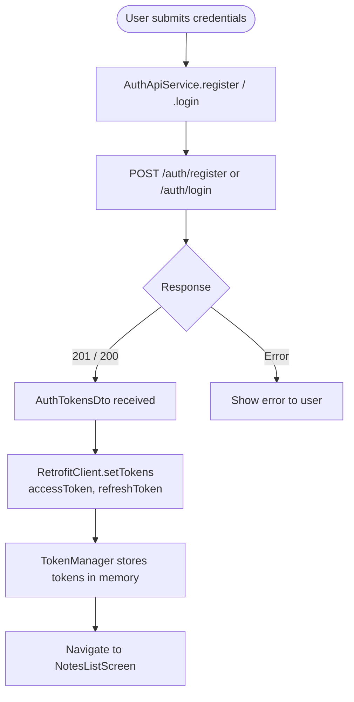
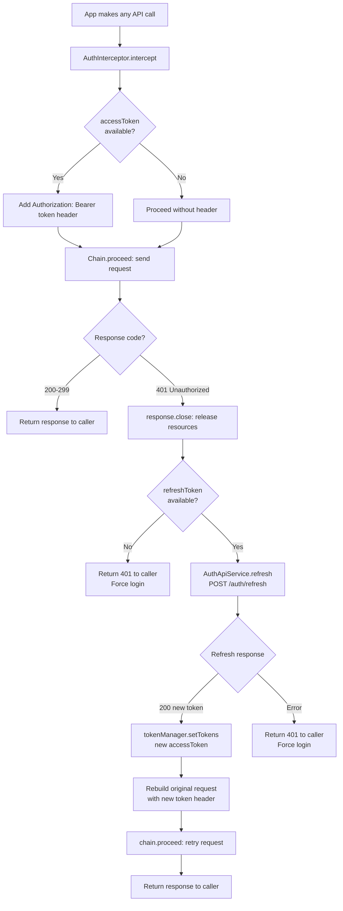

> **Note:** Flowcharts use [Mermaid](https://mermaid.js.org/) syntax. View rendered diagrams in: **VS Code** (install "Markdown Preview Mermaid Support"), **GitHub** (renders automatically), or **Obsidian/Notion** (native support).

# 02 — Auth Flow

## Overview

Auth covers three scenarios:
1. **Register** — new user creates an account
2. **Login** — existing user signs in
3. **Silent token refresh** — access token expires mid-session, transparently refreshed

> **Note:** This app currently has no login/register UI screen — auth flow is implemented at the network layer (interceptor + API service). A dedicated auth feature screen would be added as the next app in the series.

---

## Register / Login Flow



---

## Silent Token Refresh Flow (401 Handling)

This happens automatically inside `AuthInterceptor` — the user never sees it.



---

## Classes Involved

| Class | Module | Role |
|-------|--------|------|
| `AuthApiService` | `:core:network` | Retrofit interface for auth endpoints |
| `AuthInterceptor` | `:core:network` | OkHttp interceptor: attach token + 401 refresh |
| `TokenManager` | `:core:network` | In-memory storage for access/refresh tokens |
| `RetrofitClient` | `:core:network` | Singleton Retrofit setup, exposes setTokens() |
| `AuthTokensDto` | `:core:network` | Response model: {accessToken, refreshToken} |
| `RegisterRequestDto` | `:core:network` | Request model: {email, password} |
| `LoginRequestDto` | `:core:network` | Request model: {email, password} |
| `RefreshTokenRequestDto` | `:core:network` | Request model: {refreshToken} |

---

## Auth API Endpoints

| Method | Endpoint | Request | Response |
|--------|---------|---------|---------|
| POST | `/auth/register` | `{email, password}` | `201` `{accessToken, refreshToken}` |
| POST | `/auth/login` | `{email, password}` | `200` `{accessToken, refreshToken}` |
| POST | `/auth/refresh` | `{refreshToken}` | `200` `{accessToken}` |
| POST | `/auth/logout` | `{refreshToken}` | `200` |
| GET | `/auth/me` | — (Bearer header) | `200` `{id, email, createdAt}` |

---

## Data State at Each Stage

### Stage 1: Register Request
```
POST /auth/register
Body:
RegisterRequestDto(
  email = "user@example.com",
  password = "secret123"
)
```

### Stage 2: Server Response (201)
```
AuthTokensDto(
  accessToken = "eyJhbGci....",   // JWT, 15 min expiry
  refreshToken = "rt_abc123..."   // 30 day expiry, NOT rotated on refresh
)
```

### Stage 3: TokenManager stores tokens
```
TokenManager {
  accessToken = "eyJhbGci...."
  refreshToken = "rt_abc123..."
}
```

### Stage 4: Every subsequent API request
```
OkHttp Request Headers:
  Authorization: Bearer eyJhbGci....
```

### Stage 5: 401 triggers refresh
```
POST /auth/refresh
Body:
RefreshTokenRequestDto(
  refreshToken = "rt_abc123..."
)

Response:
AuthTokensDto(
  accessToken = "eyJnewToken..."  // new access token
  refreshToken = "rt_abc123..."   // SAME refresh token (not rotated)
)
```

### Stage 6: Retry with new token
```
OkHttp Request Headers (retry):
  Authorization: Bearer eyJnewToken...
```

---

## Token Lifecycle

```
Register/Login
    │
    ▼
accessToken ──── 15 min expiry ────► 401 ──► silent refresh ──► new accessToken
    │
refreshToken ─── 30 day expiry ───► if expired, force login
```

---

## Important Notes

- **Refresh token is NOT rotated** — same refresh token stays valid for 30 days
- **Only one retry** — if the refreshed token also gets a 401, return the error (don't loop)
- **In-memory only** — tokens are lost on app restart (production would use encrypted SharedPreferences/DataStore)
- **Thread safety** — `AuthInterceptor` runs on OkHttp's network thread; `TokenManager` is not thread-safe (acceptable for this scale)
