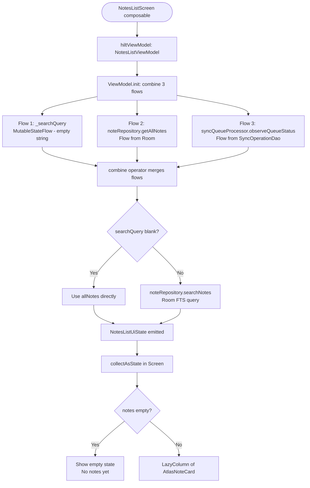
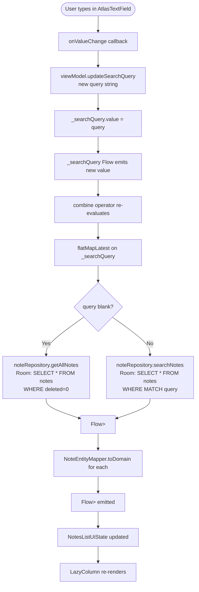
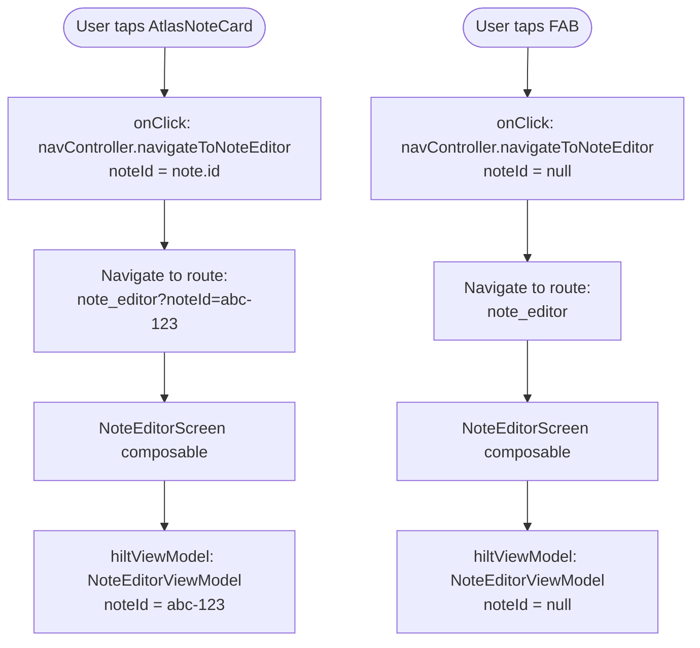

> **Note:** Flowcharts use [Mermaid](https://mermaid.js.org/) syntax. View rendered diagrams in: **VS Code** (install "Markdown Preview Mermaid Support"), **GitHub** (renders automatically), or **Obsidian/Notion** (native support).

# 03 — Notes List Flow

## Overview

The notes list screen is the home screen of the app. It:
- Displays all non-deleted notes from Room, sorted by `updatedAt` DESC
- Allows searching via FTS (full-text search)
- Shows a sync status indicator ("Syncing...", "X changes pending", or hidden)
- Navigates to note editor on tap (existing note) or FAB tap (new note)

---

## Screen Load Flow



---

## Search Flow



---

## Navigation Flow



---

## Classes Involved

| Class | Module | Role |
|-------|--------|------|
| `NotesListScreen` | `:feature:notes-list` | Compose UI: renders list, search, FAB |
| `NotesListViewModel` | `:feature:notes-list` | Combines flows, manages search query |
| `NotesListUiState` | `:feature:notes-list` | Immutable state (notes, query, syncStatus) |
| `NoteRepository` | `:core:database` | getAllNotes(), searchNotes() |
| `NoteDao` | `:core:database` | Room queries: SELECT, FTS MATCH |
| `NoteFts` | `:core:database` | @Fts4 virtual table (title, content) |
| `NoteEntityMapper` | `:core:database` | NoteEntity → Note (strips syncStatus) |
| `SyncQueueProcessor` | `:core:sync` | observeQueueStatus() → Flow<SyncQueueStatus> |
| `SyncOperationDao` | `:core:database` | observePendingCount() → Flow<Int> |
| `AtlasNoteCard` | `:core:designsystem` | Renders individual note preview |
| `AtlasSyncIndicator` | `:core:designsystem` | Shows sync status |
| `AtlasTextField` | `:core:designsystem` | Search input field |
| `NavigationUtils` | `:core:navigation` | navigateToNoteEditor() helper |

---

## Room Queries

### getAllNotes()
```sql
SELECT * FROM notes
WHERE deleted = 0
ORDER BY updatedAt DESC
```

### searchNotes(query)
```sql
SELECT * FROM notes
WHERE deleted = 0
AND (title MATCH :query OR content MATCH :query)
ORDER BY updatedAt DESC
```
> Uses FTS4 virtual table `notes_fts` for fast full-text search

### observePendingCount()
```sql
SELECT COUNT(*)
FROM sync_operations
WHERE status IN ('PENDING', 'SYNCING')
```

---

## Data State at Each Stage

### Stage 1: Raw Room query result
```
List<NoteEntity> [
  NoteEntity(
    id = "abc-123",
    title = "Meeting Notes",
    content = "Discussed Q4 targets...",
    folderOrLabel = "Work",
    updatedAt = "2024-01-15T10:30:00Z",
    deleted = false,
    syncStatus = SyncStatus.SYNCED   ← UI never sees this
  ),
  ...
]
```

### Stage 2: After mapper
```
List<Note> [
  Note(
    id = "abc-123",
    title = "Meeting Notes",
    content = "Discussed Q4 targets...",
    folderOrLabel = "Work",
    updatedAt = "2024-01-15T10:30:00Z"
  ),
  ...
]
```

### Stage 3: NotesListUiState
```
NotesListUiState(
  notes = [Note("abc-123", ...), Note("def-456", ...)],
  searchQuery = "meeting",
  syncStatus = SyncQueueStatus(
    pendingCount = 2,
    isSyncing = true,
    lastSyncedAt = "2024-01-15T10:25:00Z"
  ),
  isLoading = false
)
```

### Stage 4: AtlasSyncIndicator renders
```
pendingCount = 2, isSyncing = true
→ Shows: spinner + "Syncing..."

pendingCount = 3, isSyncing = false
→ Shows: "3 changes pending"

pendingCount = 0, isSyncing = false
→ Hidden (returns early, nothing rendered)
```

### Stage 5: AtlasNoteCard renders
```
AtlasNoteCard(
  title = "Meeting Notes",
  content = "Discussed Q4 targets..."  // max 2 lines, ellipsized
  label = "Work",
  onClick = { navigateToNoteEditor("abc-123") }
)
```

---

## FTS (Full-Text Search) Details

Room's `@Fts4` creates a hidden virtual table `notes_fts` that indexes `title` and `content`. When a `MATCH` query runs:

```
User types: "meeting"
      │
      ▼
Room FTS index scans notes_fts
      │
      ▼
Returns rowids matching "meeting" in title OR content
      │
      ▼
Joins with notes table to get full NoteEntity rows
      │
      ▼
NoteEntityMapper strips syncStatus
      │
      ▼
Flow<List<Note>> emits filtered results instantly
```

This is significantly faster than `LIKE '%meeting%'` on large note databases because FTS uses an inverted index.
