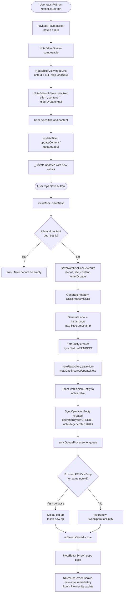

> **Note:** Flowcharts use [Mermaid](https://mermaid.js.org/) syntax. View rendered diagrams in: **VS Code** (install "Markdown Preview Mermaid Support"), **GitHub** (renders automatically), or **Obsidian/Notion** (native support).

# 04 — Note Creation Flow

## Overview

When a user creates a new note:
1. A local UUID is generated immediately
2. The note is written to Room with `syncStatus = PENDING`
3. A sync operation is enqueued to the SyncQueueProcessor
4. The UI reflects the change immediately (optimistic update)
5. WorkManager syncs to the server in the background

---

## Full Creation Flow



---

## Classes Involved

| Class | Module | Role |
|-------|--------|------|
| `NoteEditorScreen` | `:feature:note-editor` | Compose UI: title/content fields, save button |
| `NoteEditorViewModel` | `:feature:note-editor` | State management, calls SaveNoteUseCase |
| `NoteEditorUiState` | `:feature:note-editor` | Immutable UI state |
| `SaveNoteUseCase` | `:feature:note-editor` | Orchestrates local save + sync enqueue |
| `NoteRepository` | `:core:database` | saveNote() → NoteDao.insertOrUpdateNote |
| `NoteDao` | `:core:database` | INSERT OR REPLACE into notes table |
| `SyncQueueProcessor` | `:core:sync` | enqueue() with collapsing logic |
| `SyncOperationDao` | `:core:database` | INSERT into sync_operations table |
| `NotesListViewModel` | `:feature:notes-list` | Observes Flow, re-renders list automatically |

---

## Data State at Each Stage

### Stage 1: ViewModel initialized (new note)
```
NoteEditorUiState(
  title = "",
  content = "",
  folderOrLabel = null,
  isLoading = false,
  isSaved = false,
  error = null
)
noteId = null  ← no note exists yet
```

### Stage 2: User types content
```
NoteEditorUiState(
  title = "Shopping List",
  content = "Milk, eggs, bread",
  folderOrLabel = "Personal",
  isLoading = false,
  isSaved = false,
  error = null
)
```

### Stage 3: SaveNoteUseCase generates IDs
```
noteId = "f47ac10b-58cc-4372-a567-0e02b2c3d479"  ← UUID.randomUUID()
now = "2024-01-15T10:30:00.000Z"                  ← Instant.now().toString()
```

### Stage 4: NoteEntity written to Room
```
NoteEntity(
  id = "f47ac10b-58cc-4372-a567-0e02b2c3d479",
  title = "Shopping List",
  content = "Milk, eggs, bread",
  folderOrLabel = "Personal",
  updatedAt = "2024-01-15T10:30:00.000Z",
  deleted = false,
  syncStatus = SyncStatus.PENDING    ← not yet synced to server
)
```

### Stage 5: SyncOperationEntity written to queue
```
SyncOperationEntity(
  id = 1 (auto-increment),
  localId = "a1b2c3d4-...",           ← new UUID for tracking this operation
  operationType = "UPSERT",
  noteId = "f47ac10b-...",            ← same UUID as NoteEntity.id
  title = "Shopping List",
  content = "Milk, eggs, bread",
  folderOrLabel = "Personal",
  clientUpdatedAt = "2024-01-15T10:30:00.000Z",
  status = "PENDING"
)
```

### Stage 6: uiState after save
```
NoteEditorUiState(
  title = "Shopping List",
  content = "Milk, eggs, bread",
  folderOrLabel = "Personal",
  isLoading = false,
  isSaved = true,    ← triggers popBackStack()
  error = null
)
```

### Stage 7: NotesListScreen auto-updates
```
Room Flow<List<NoteEntity>> emits new list including the new note
     │
     ▼
NoteEntityMapper.toDomain strips syncStatus
     │
     ▼
NotesListUiState.notes now includes:
  Note(
    id = "f47ac10b-...",
    title = "Shopping List",
    content = "Milk, eggs, bread",
    folderOrLabel = "Personal",
    updatedAt = "2024-01-15T10:30:00.000Z"
  )
     │
     ▼
LazyColumn re-renders with new AtlasNoteCard
```

---

## Optimistic Update Explained

The key insight is that the UI never waits for the network:

```
User taps Save
    │
    ├──► Room write (immediate, ~1ms)
    │         │
    │         └──► Flow emits → UI shows note instantly ✅
    │
    └──► Sync queue (immediate, ~1ms)
              │
              └──► WorkManager sends to server (background, seconds later)
                        │
                        └──► Server responds → local note updated with server's version
```

If the network call fails, the note still appears in the UI — the queue just retries later.

---

## What Happens If Save Fails

```
saveNote() throws Exception
    │
    ▼
NoteEditorViewModel.saveNote() catch block
    │
    ▼
_uiState.value = uiState.copy(
  isLoading = false,
  error = "Failed to save note: <message>"
)
    │
    ▼
NoteEditorScreen shows error text in red
    │
    ▼
viewModel.clearError() dismisses it
```
