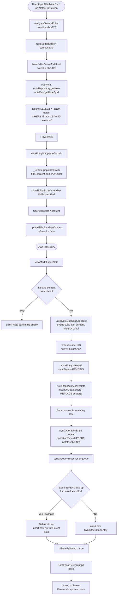

> **Note:** Flowcharts use [Mermaid](https://mermaid.js.org/) syntax. View rendered diagrams in: **VS Code** (install "Markdown Preview Mermaid Support"), **GitHub** (renders automatically), or **Obsidian/Notion** (native support).

# 05 — Note Edit Flow

## Overview

When a user edits an existing note:
1. The note is loaded from Room by id
2. The user modifies title/content/label
3. On save, the note is updated locally with `syncStatus = PENDING`
4. A new `UPSERT` sync operation is enqueued (collapsing any previous pending op for this note)
5. The UI pops back to the list, which reflects the change immediately

---

## Full Edit Flow



---

## Classes Involved

| Class | Module | Role |
|-------|--------|------|
| `NoteEditorScreen` | `:feature:note-editor` | Pre-filled text fields, save/delete actions |
| `NoteEditorViewModel` | `:feature:note-editor` | Loads note, manages state, calls SaveNoteUseCase |
| `NoteEditorUiState` | `:feature:note-editor` | Immutable state snapshot |
| `SaveNoteUseCase` | `:feature:note-editor` | Local REPLACE + sync UPSERT enqueue |
| `NoteRepository` | `:core:database` | getNote() for load, saveNote() for update |
| `NoteDao` | `:core:database` | getNoteById(), insertOrUpdateNote() |
| `SyncQueueProcessor` | `:core:sync` | enqueue() with collapsing |
| `SyncOperationDao` | `:core:database` | getPendingOperations(), deleteOperation(), enqueueOperation() |

---

## Data State at Each Stage

### Stage 1: Load existing note from Room
```sql
SELECT * FROM notes WHERE id = 'abc-123' AND deleted = 0
```

### Stage 2: NoteEntity from Room
```
NoteEntity(
  id = "abc-123",
  title = "Shopping List",
  content = "Milk, eggs, bread",
  folderOrLabel = "Personal",
  updatedAt = "2024-01-15T10:30:00Z",
  deleted = false,
  syncStatus = SyncStatus.SYNCED
)
```

### Stage 3: ViewModel state pre-filled
```
NoteEditorUiState(
  title = "Shopping List",
  content = "Milk, eggs, bread",
  folderOrLabel = "Personal",
  isLoading = false,
  isSaved = false,
  error = null
)
```

### Stage 4: User edits content
```
NoteEditorUiState(
  title = "Shopping List (updated)",
  content = "Milk, eggs, bread, butter",
  folderOrLabel = "Personal",
  isLoading = false,
  isSaved = false,    ← user made changes
  error = null
)
```

### Stage 5: NoteEntity updated in Room
```
NoteEntity(
  id = "abc-123",
  title = "Shopping List (updated)",
  content = "Milk, eggs, bread, butter",
  folderOrLabel = "Personal",
  updatedAt = "2024-01-15T11:00:00Z",   ← new client timestamp
  deleted = false,
  syncStatus = SyncStatus.PENDING        ← needs to sync
)
```

### Stage 6: SyncOperationEntity in queue
```
SyncOperationEntity(
  id = 2 (auto-increment),
  localId = "new-uuid-...",
  operationType = "UPSERT",
  noteId = "abc-123",                   ← existing note's id
  title = "Shopping List (updated)",
  content = "Milk, eggs, bread, butter",
  folderOrLabel = "Personal",
  clientUpdatedAt = "2024-01-15T11:00:00Z",
  status = "PENDING"
)
```

---

## Operation Collapsing Explained

If a user edits the same note twice before syncing:

```
Edit 1 → SyncOperationEntity(id=1, noteId="abc-123", title="Version 1", status=PENDING)
Edit 2 → syncQueueProcessor.enqueue(...)
    │
    ▼
getPendingOperations() finds existing op with noteId="abc-123"
    │
    ▼
deleteOperation(id=1)  ← delete old op
    │
    ▼
enqueueOperation(...)  ← insert new op with latest state
    │
    ▼
SyncOperationEntity(id=2, noteId="abc-123", title="Version 2", status=PENDING)
```

**Result:** Only "Version 2" gets sent to the server. No intermediate state is synced. This prevents redundant API calls and keeps the queue lean.

---

## Why REPLACE Strategy in Room

`NoteDao.insertOrUpdateNote()` uses `@Insert(onConflict = OnConflictStrategy.REPLACE)`:

```
First save:   INSERT INTO notes (id, ...) VALUES ('abc-123', ...)
Second save:  INSERT OR REPLACE INTO notes (id, ...) VALUES ('abc-123', ...)
              → SQLite detects same primary key
              → Deletes old row, inserts new row
              → Flow emits updated list automatically
```

This is safe because the `id` is stable (generated on first creation, never changes).
