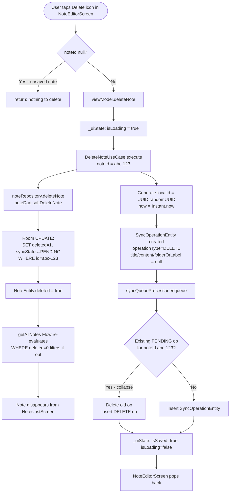

> **Note:** Flowcharts use [Mermaid](https://mermaid.js.org/) syntax. View rendered diagrams in: **VS Code** (install "Markdown Preview Mermaid Support"), **GitHub** (renders automatically), or **Obsidian/Notion** (native support).

# 06 — Note Deletion Flow

## Overview

Deletion in this app is a **soft-delete** — notes are never physically removed from Room. Instead:
1. `deleted = true` is set on the `NoteEntity`
2. A `DELETE` sync operation is enqueued
3. The note disappears from the UI immediately (all queries filter `WHERE deleted = 0`)
4. WorkManager sends the DELETE to the server in the background
5. Only after the server confirms deletion does the operation leave the queue

---

## Full Deletion Flow



---

## Classes Involved

| Class | Module | Role |
|-------|--------|------|
| `NoteEditorScreen` | `:feature:note-editor` | Delete icon in TopAppBar (only if noteId != null) |
| `NoteEditorViewModel` | `:feature:note-editor` | Calls DeleteNoteUseCase, guards against null noteId |
| `DeleteNoteUseCase` | `:feature:note-editor` | Soft-delete + DELETE sync enqueue |
| `NoteRepository` | `:core:database` | deleteNote() → NoteDao.softDeleteNote() |
| `NoteDao` | `:core:database` | SQL UPDATE: deleted=1, syncStatus=PENDING |
| `SyncQueueProcessor` | `:core:sync` | enqueue() with collapsing |
| `SyncOperationDao` | `:core:database` | INSERT sync operation |

---

## Room Query for Soft-Delete

```sql
UPDATE notes
SET deleted = 1, syncStatus = 'PENDING'
WHERE id = 'abc-123'
```

This is handled by `NoteDao.softDeleteNote()`:
```kotlin
@Query("UPDATE notes SET deleted = 1, syncStatus = :syncStatus WHERE id = :id")
suspend fun softDeleteNote(id: String, syncStatus: String)
```

---

## Data State at Each Stage

### Stage 1: Note before deletion
```
NoteEntity(
  id = "abc-123",
  title = "Shopping List",
  content = "Milk, eggs, bread",
  folderOrLabel = "Personal",
  updatedAt = "2024-01-15T10:30:00Z",
  deleted = false,                    ← currently visible
  syncStatus = SyncStatus.SYNCED
)
```

### Stage 2: After softDeleteNote()
```
NoteEntity(
  id = "abc-123",
  title = "Shopping List",
  content = "Milk, eggs, bread",
  folderOrLabel = "Personal",
  updatedAt = "2024-01-15T10:30:00Z",
  deleted = true,                     ← filtered out by WHERE deleted=0
  syncStatus = SyncStatus.PENDING     ← needs sync
)
```

### Stage 3: SyncOperationEntity for DELETE
```
SyncOperationEntity(
  id = 3 (auto-increment),
  localId = "new-uuid-...",
  operationType = "DELETE",
  noteId = "abc-123",
  title = null,            ← DELETE doesn't need content
  content = null,
  folderOrLabel = null,
  clientUpdatedAt = "2024-01-15T11:15:00Z",
  status = "PENDING"
)
```

### Stage 4: Sync request to server
```
POST /notes/sync
{
  "operations": [
    {
      "localId": "new-uuid-...",
      "operationType": "DELETE",
      "noteId": "abc-123",
      "title": null,
      "content": null,
      "folderOrLabel": null,
      "clientUpdatedAt": "2024-01-15T11:15:00Z"
    }
  ]
}
```

### Stage 5: Server response (applied)
```
{
  "results": [
    {
      "localId": "new-uuid-...",
      "status": "applied",
      "note": null,         ← null for DELETE (note no longer exists)
      "message": null
    }
  ]
}
```

### Stage 6: SyncQueueProcessor processes response
```
result.status = "applied"
    │
    ▼
syncOperationDao.deleteOperation(id=3)   ← remove from queue
    │
    ▼
Queue is empty → SyncQueueStatus(pendingCount=0, isSyncing=false)
```

---

## Why Soft-Delete (Not Hard-Delete)

Physical deletion would cause a race condition:
```
Client deletes note locally
    │
    ├──► Room: DELETE FROM notes WHERE id='abc-123'
    │
    └──► Need to sync DELETE to server
              │
              └──► But note is gone — how do we know what to tell the server?
```

With soft-delete:
```
Client soft-deletes note
    │
    ├──► Room: UPDATE notes SET deleted=1 WHERE id='abc-123'
    │    (note still exists, just hidden from UI)
    │
    └──► Sync sends DELETE operation to server
              │
              └──► Server confirms
                        │
                        └──► SyncQueueProcessor cleans up
```

The note stays in the database until sync confirms the server received the DELETE. If the app is uninstalled before sync, the server still has the note — but that's an acceptable trade-off at this scale.

---

## DELETE vs UPSERT in the Queue

```
┌─────────────────────────────────────────────────────────┐
│                SyncOperationEntity                       │
├─────────────────────────────────────────────────────────┤
│ UPSERT: noteId, title, content, folderOrLabel all set   │
│ DELETE: noteId set, title/content/folderOrLabel = null  │
└─────────────────────────────────────────────────────────┘
```

The server only needs `noteId` to process a DELETE. Sending null for other fields keeps the contract clean.
