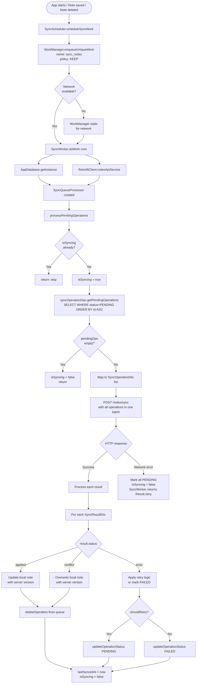
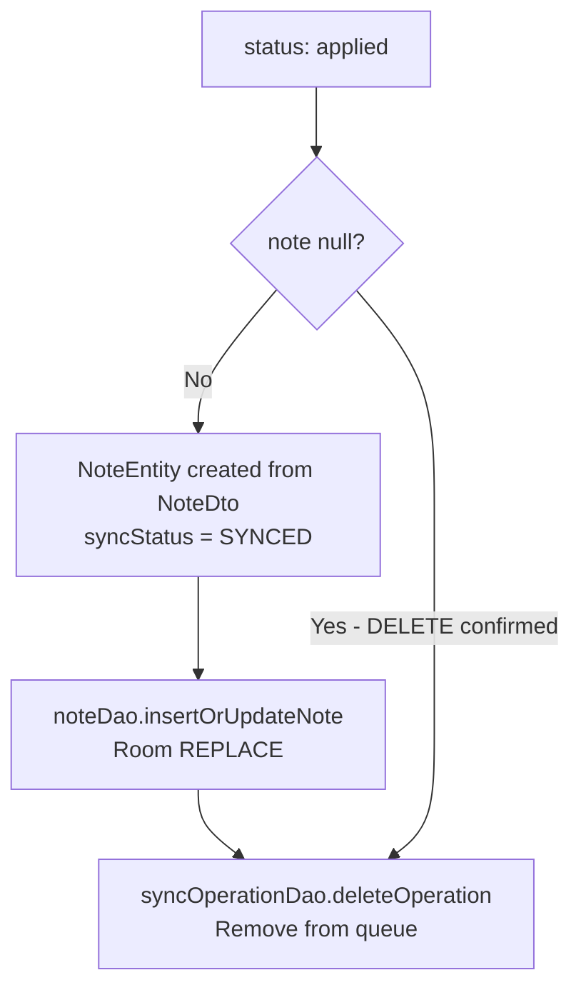
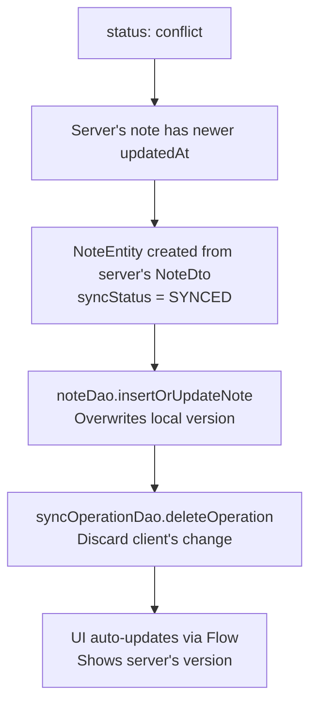
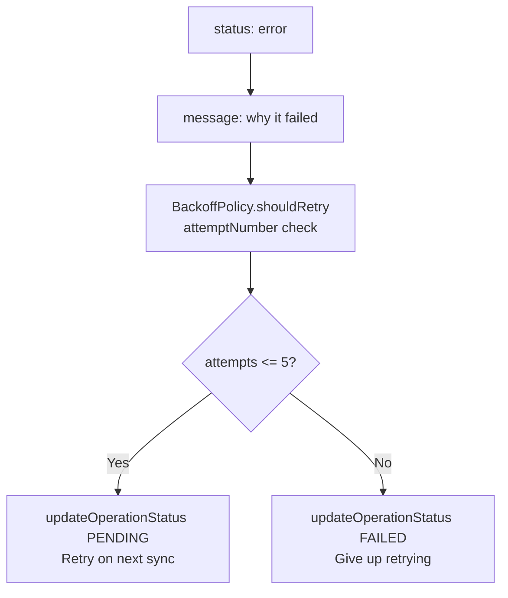

> **Note:** Flowcharts use [Mermaid](https://mermaid.js.org/) syntax. View rendered diagrams in: **VS Code** (install "Markdown Preview Mermaid Support"), **GitHub** (renders automatically), or **Obsidian/Notion** (native support).

# 07 — Background Sync Flow

## Overview

Background sync is the mechanism that sends local changes (creates, edits, deletes) to the server. It runs automatically via WorkManager whenever:
- The device has network connectivity
- There are pending operations in the `sync_operations` table

The sync engine (`SyncQueueProcessor`) sends all pending operations in a single batch to `POST /notes/sync`, then processes each result individually.

---

## Sync Trigger Flow



---

## Classes Involved

| Class | Module | Role |
|-------|--------|------|
| `SyncScheduler` | `:core:sync` | Enqueues unique WorkManager job |
| `SyncWorker` | `:core:sync` | WorkManager CoroutineWorker, calls processPendingOperations |
| `SyncQueueProcessor` | `:core:sync` | Fetches queue, batches to server, processes results |
| `BackoffPolicy` | `:core:sync` | Computes retry delay (exponential + jitter) |
| `SyncOperationDao` | `:core:database` | getPendingOperations, updateOperationStatus, deleteOperation |
| `NoteDao` | `:core:database` | insertOrUpdateNote (applies server version) |
| `NotesApiService` | `:core:network` | POST /notes/sync |
| `SyncRequestDto` | `:core:network` | Batch sync request body |
| `SyncResponseDto` | `:core:network` | Batch sync response body |
| `SyncResultDto` | `:core:network` | Per-operation result (localId, status, note) |
| `NoteDto` | `:core:network` | Server Note shape in response |

---

## Batch Sync Request / Response

### Request sent to server
```
POST /notes/sync
Authorization: Bearer <accessToken>
Content-Type: application/json

SyncRequestDto(
  operations = [
    SyncOperationDto(
      localId = "a1b2c3-...",
      operationType = "UPSERT",
      noteId = "f47ac10b-...",
      title = "Shopping List",
      content = "Milk, eggs, bread",
      folderOrLabel = "Personal",
      clientUpdatedAt = "2024-01-15T10:30:00Z"
    ),
    SyncOperationDto(
      localId = "d4e5f6-...",
      operationType = "DELETE",
      noteId = "abc-123",
      title = null,
      content = null,
      folderOrLabel = null,
      clientUpdatedAt = "2024-01-15T11:15:00Z"
    )
  ]
)
```

### Response from server
```
SyncResponseDto(
  results = [
    SyncResultDto(
      localId = "a1b2c3-...",
      status = "applied",
      note = NoteDto(
        id = "f47ac10b-...",
        userId = "user-xyz",
        title = "Shopping List",
        content = "Milk, eggs, bread",
        folderOrLabel = "Personal",
        updatedAt = "2024-01-15T10:30:01Z",   ← server assigns final timestamp
        deleted = false
      ),
      message = null
    ),
    SyncResultDto(
      localId = "d4e5f6-...",
      status = "applied",
      note = null,
      message = null
    )
  ]
)
```

---

## Status Result Handling

### "applied" — operation succeeded



```
Before: NoteEntity(id="f47ac10b", syncStatus=PENDING, updatedAt="client time")
After:  NoteEntity(id="f47ac10b", syncStatus=SYNCED, updatedAt="server time")
```

### "conflict" — server version wins



```
Client's version: updatedAt = "2024-01-15T11:00:00Z", title = "My edit"
Server's version: updatedAt = "2024-01-15T11:05:00Z", title = "Server's edit"

Result: Server wins. Client's edit is discarded.
        NoteEntity updated with server's title and updatedAt.
```

### "error" — operation failed



---

## BackoffPolicy Details

```
Attempt 1: delay = 1s  * 2^1 = 2s  + jitter
Attempt 2: delay = 1s  * 2^2 = 4s  + jitter
Attempt 3: delay = 1s  * 2^3 = 8s  + jitter
Attempt 4: delay = 1s  * 2^4 = 16s + jitter
Attempt 5: delay = 1s  * 2^5 = 30s (capped) + jitter
Attempt 6: return -1  → mark FAILED, stop retrying

Jitter: ±10% of delay (random direction)
Purpose: Prevents thundering herd (all clients retrying at same time)
```

---

## WorkManager Constraints

```kotlin
Constraints.Builder()
    .setRequiredNetworkType(NetworkType.CONNECTED)
    .build()
```

- Sync only runs when device has network (WiFi or mobile data)
- WorkManager re-queues automatically when device goes offline mid-sync
- `ExistingWorkPolicy.KEEP` — if sync is already queued/running, don't create a duplicate

---

## SyncQueueStatus → UI

`SyncQueueProcessor.observeQueueStatus()` returns `Flow<SyncQueueStatus>`:

```
syncOperationDao.observePendingCount()  ← Flow<Int> from Room
    │
    map { count ->
        SyncQueueStatus(
            pendingCount = count,
            isSyncing = isSyncing,     ← in-memory boolean
            lastSyncedAt = lastSyncedAt
        )
    }
    │
    ▼
NotesListViewModel combines this with notes Flow
    │
    ▼
AtlasSyncIndicator renders:
  pendingCount=0, isSyncing=true  → "Syncing..."
  pendingCount=3, isSyncing=false → "3 changes pending"
  pendingCount=0, isSyncing=false → hidden
```

---

## Sync Queue Table States

```
┌────┬────────────┬───────────────┬──────────────┬──────────┐
│ id │ localId    │ operationType │ noteId       │ status   │
├────┼────────────┼───────────────┼──────────────┼──────────┤
│  1 │ a1b2c3-... │ UPSERT        │ f47ac10b-... │ PENDING  │
│  2 │ d4e5f6-... │ DELETE        │ abc-123      │ PENDING  │
│  3 │ g7h8i9-... │ UPSERT        │ xyz-789      │ FAILED   │
└────┴────────────┴───────────────┴──────────────┴──────────┘

After successful sync of operations 1 and 2:
┌────┬────────────┬───────────────┬──────────────┬──────────┐
│  3 │ g7h8i9-... │ UPSERT        │ xyz-789      │ FAILED   │
└────┴────────────┴───────────────┴──────────────┴──────────┘
```
