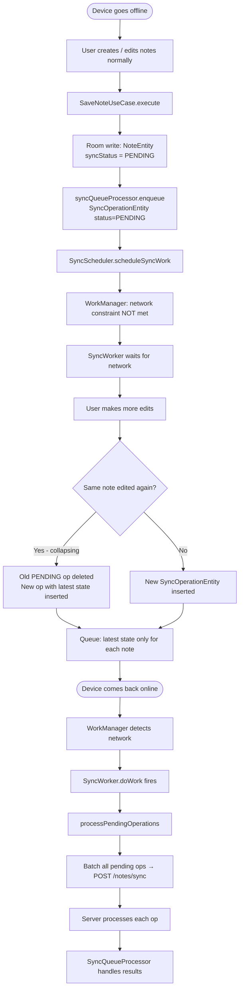
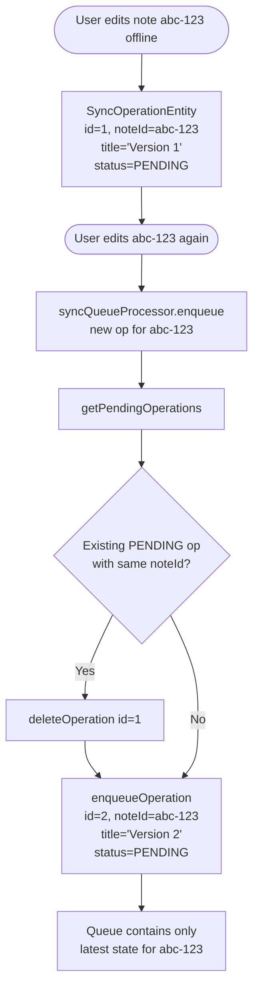
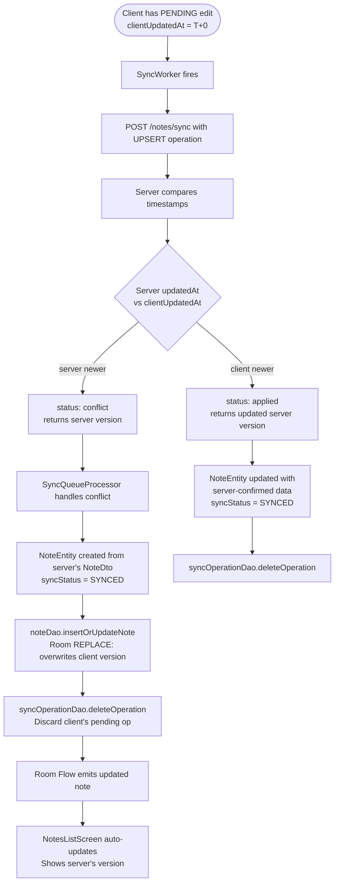

> **Note:** Flowcharts use [Mermaid](https://mermaid.js.org/) syntax. View rendered diagrams in: **VS Code** (install "Markdown Preview Mermaid Support"), **GitHub** (renders automatically), or **Obsidian/Notion** (native support).

# 08 — Offline & Conflict Resolution Flow

## Overview

This doc covers two related scenarios:
1. **Offline editing** — user makes changes with no network; queue builds up; sync fires when back online
2. **Conflict resolution** — server's version of a note has changed after the client last synced; server's version wins (last-write-wins by timestamp)

---

## Offline Editing Flow



---

## Operation Collapsing (Offline Edits)



---

## Conflict Resolution Flow

A conflict occurs when:
- Client has a PENDING change for a note (e.g., edited at T=10:00)
- Server already has a newer version of the same note (e.g., updated at T=10:05 by another device or via the debug endpoint)



---

## Classes Involved

| Class | Module | Role |
|-------|--------|------|
| `SyncQueueProcessor` | `:core:sync` | Detects conflict in response, applies server version |
| `NoteDao` | `:core:database` | insertOrUpdateNote (REPLACE) — overwrites local on conflict |
| `SyncOperationDao` | `:core:database` | deleteOperation — removes conflicted op from queue |
| `NotesApiService` | `:core:network` | POST /notes/sync |
| `SyncResultDto` | `:core:network` | Per-operation result with status: "conflict" |
| `NoteDto` | `:core:network` | Server's winning version of the note |
| `NotesListViewModel` | `:feature:notes-list` | Observes Flow, re-renders with server's version |

---

## Conflict Data State

### Before Conflict

**Client's local state (Room):**
```
NoteEntity(
  id = "abc-123",
  title = "Client's edit",
  content = "Client wrote this",
  updatedAt = "2024-01-15T10:00:00Z",    ← client's timestamp
  syncStatus = SyncStatus.PENDING
)
```

**Client's sync operation (queue):**
```
SyncOperationEntity(
  localId = "op-uuid-...",
  operationType = "UPSERT",
  noteId = "abc-123",
  title = "Client's edit",
  content = "Client wrote this",
  clientUpdatedAt = "2024-01-15T10:00:00Z"
)
```

**Server's state (unknown to client):**
```
NoteDto on server:
  id = "abc-123"
  title = "Server's edit"
  content = "Server wrote this"
  updatedAt = "2024-01-15T10:05:00Z"    ← NEWER than client's timestamp
```

---

### During Sync

**Request sent:**
```json
{
  "operations": [{
    "localId": "op-uuid-...",
    "operationType": "UPSERT",
    "noteId": "abc-123",
    "title": "Client's edit",
    "content": "Client wrote this",
    "clientUpdatedAt": "2024-01-15T10:00:00Z"
  }]
}
```

**Server compares:**
```
clientUpdatedAt = "2024-01-15T10:00:00Z"
server updatedAt = "2024-01-15T10:05:00Z"
server is NEWER → conflict!
```

**Response received:**
```json
{
  "results": [{
    "localId": "op-uuid-...",
    "status": "conflict",
    "note": {
      "id": "abc-123",
      "title": "Server's edit",
      "content": "Server wrote this",
      "updatedAt": "2024-01-15T10:05:00Z",
      "deleted": false
    },
    "message": null
  }]
}
```

---

### After Conflict Resolution

**Room updated with server's version:**
```
NoteEntity(
  id = "abc-123",
  title = "Server's edit",          ← server wins
  content = "Server wrote this",    ← server wins
  updatedAt = "2024-01-15T10:05:00Z",
  syncStatus = SyncStatus.SYNCED
)
```

**Queue cleaned:**
```
SyncOperationEntity for "abc-123" deleted
pendingCount → 0
```

**UI auto-updates:**
```
Room Flow<NoteEntity> emits updated row
    │
    ▼
NoteEntityMapper.toDomain
    │
    ▼
NotesListUiState.notes updates
    │
    ▼
AtlasNoteCard shows "Server's edit"
```

---

## Testing Conflicts with Debug Endpoint

The backend provides a debug endpoint to trigger conflicts deterministically:

```
POST /debug/simulateConflict/notes/{id}
```

This bumps the note's `updatedAt` on the server without changing content.

**Manual test steps:**
1. Create a note and let it sync (status = SYNCED)
2. Hit `POST /debug/simulateConflict/notes/{noteId}` — server's `updatedAt` is now newer
3. Edit the note locally (client's `updatedAt` is older than server's)
4. Save — SyncQueueProcessor sends UPSERT, server returns `"conflict"`
5. Watch the note revert to the server's version in the UI

---

## Offline Queue Build-Up Example

```
T=0:  Device goes offline

T=1:  User creates Note A
      Queue: [SyncOp(localId=1, noteId=A, op=UPSERT, title="Draft")]

T=2:  User edits Note A
      Queue: [SyncOp(localId=2, noteId=A, op=UPSERT, title="Updated")]
      ← localId=1 deleted (collapsed)

T=3:  User creates Note B
      Queue: [SyncOp(localId=2, noteId=A, ...), SyncOp(localId=3, noteId=B, ...)]

T=4:  User deletes Note A
      Queue: [SyncOp(localId=4, noteId=A, op=DELETE), SyncOp(localId=3, noteId=B, ...)]
      ← localId=2 (UPSERT for A) deleted, replaced with DELETE

T=5:  Device comes back online

T=6:  SyncWorker fires
      POST /notes/sync with 2 operations:
        - DELETE for Note A
        - UPSERT for Note B

T=7:  Server responds:
        - Note A: applied (deleted)
        - Note B: applied (created)

T=8:  Queue cleared
      SyncQueueStatus(pendingCount=0, isSyncing=false)
```

---

## Key Design Decisions

1. **Server always wins on conflict** — simplest correct behavior; no merge strategy needed
2. **Last-write-wins by timestamp** — `clientUpdatedAt` vs server `updatedAt`
3. **No conflict UI** — conflicts are silently resolved; user sees the result (not a dialog)
4. **Operation collapsing** — prevents redundant syncs (one API call per note, not one per edit)
5. **localId for reconciliation** — since the server echoes `localId` back, we always know which local operation a result belongs to, even in large batches
